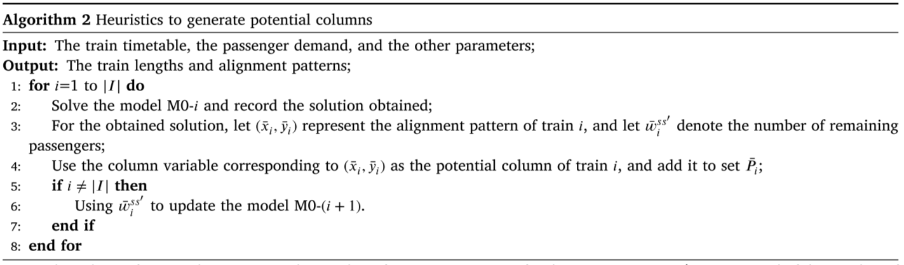
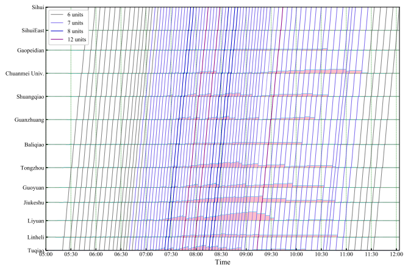

# 论文拾萃 | 如何提升过饱和地铁线路的运输能力？一种灵活的超长列车运营模式

本研究于 2025 年发表于交通领域知名期刊《Transportation Research Part B》上。该研究针对地铁过饱和客流需求，提出了一种灵活的超长列车运营模式。为了优化列车编组长度和停站位置，首先构建了适用于优化求解器和Benders分解的整数线性规划模型；然后，通过分析模型特点和求解效率，将所建模型重构为适用列生成算法的模型，并提出了分支定价算法；最后，通过多组不同规模案例验证了模型与算法的有效性，以及超长列车运营模式的优势。

## 关键词
地铁运输能力；过饱和需求；超长列车；列生成；分支定价

## 文章基本信息
>
作者：Xiaopeng Tian, Lixing Yang*
>
标题：How to improve transportation capacity of oversaturated metro lines? A flexible operation approach with extra-Long train compositions
>
文献来源：Transportation Research Part B, 2025, 195, 103188

## 摘要
>
在地铁常规运营中，统一且固定的列车编组成为提升地铁运输能力的一个关键瓶颈。本研究聚焦于基于超长列车（允许列车超出站台两端）的灵活运营模式，尝试通过优化超长列车编组方案，提升高峰时段列车运输能力。在考虑过饱和时变客流需求条件下，首先构建了一个适用优化求解器和Benders分解的整数线性规划模型，以优化列车编组长度和停站位置。然后，通过模型复杂度分析和初步计算实践表明，直接使用商用求解器和Benders方法难以高效求解大规模问题。为此，本研究对原始模型重构，将其转化为包含大量列变量的优化模型，并采用列生成算法求解其线性松弛模型，设计动态规划方法求解价格子问题。为了获得高质量整数解，本研究进一步设计了分支定价算，其中采用分层分支策略和多种加速策略提升算法求解效率。最后，通过若干组不同规模算例，验证了所提模型与算法的有效性，同时证明了超长列车运营模式能够有效减少过饱和客流乘客等待时间。

## 超长列车概念
超长列车（Exta-Long Trains）是指编组长度超出站台范围的列车概念，由Daganzo教授于2020年在《Transportation Research Part B》上正式提出。其最显著的优势之一是能够提升列车运力，有效缓解过饱和需求下的运输压力。如图1所示，在含有4个车站的地铁线路上，OD（1 → 3）、OD（1 → 4）和OD（2 → 3）的乘客数量均为100，OD（2 → 4）和OD（3 → 4）的乘客数量均为50，且假设所有乘客在列车1到达之前均已到达起点车站。此外，有2列列车从车站1运行到车站4，每个车厢可容纳50名乘客，所有站台只能对齐两个列车单元。在图1(a)所示的常规列车运行模型下，由于列车容量受限，车站2共有150名乘客无法乘坐当前列车，必须等待后续列车。相比之下，在图1(b)所示的超长列车运行模式下，所有乘客都可得到服务。这表明，超长列车能够增加列车运输能力，减少乘客等待时间。在此背景下，本文围绕超长列车运营规划展开了以下研究。
>

图1 超长列车运行示例

## 问题描述
> 
针对单条过饱和地铁线路，本文仅考虑其中一个运营方向，如图2所示。由于高峰时段列车通常以最小间隔运行，时刻表优化空间非常有限。鉴于此，本文采用了固定的列车时刻表，以及考虑了所有车站站台长度相同的场景。为便于构模，用 $\overline{l} _s$ 表示车站 $s$ 的站台长度， $t _{i}^s$ 表示设列车 $i$ 在车站 $s$ 的发车时间， $p _{ss't}$ 表示在时间间隔 $t$ 内从车站 $s$ 到 $s'$ 的乘客数量， $a^{ss'} _i$ 表示当列车 $i$ 离开车站 $s$ 时前往车站 $s'$ 的乘客到达客流量，其中 $a^{ss'} _i = \sum _{t _{0} \leq t < t^s _{i}, t \in T} p _{ss't}$ 。
>

 图2 线路示意图 

>
本文要求所有列车仅在起始站由容量、尺寸和技术标准相同的**列车单元**进行编组，允许在给定长度范围 $[\underline{m}_i, \overline{m}_i]$ 内灵活选择编组长度。对于列车 $i \in I$ ，最小长度 $\underline{m}_i$ 设为站台长度，最大长度 $\overline{m}_i$ 由可用列车单元数量决定，并用集合 $U_i = \{1, 2, \dots, \overline{m}_i\}$ 表示它可能使用的列车单元。由于超长列车的长度超过站台长度，导致不同的列车停站位置会形成差异的列车与站台的对齐关系。如图3所示，对于站台长度为6、最大列车长度为10的场景，存在5种可能的对齐关系。为便于表述，本文将这种列车与站台的对齐关系简称为**列车对齐方案**。用集合 $J^s _i$ 为列车 $i$ 在车站 $s$ 的所有候选对齐方案， $j\in J^s _i$ 。根据车站客运组织实践，乘客上下车活动在站台范围内进行。为保证乘客安全顺利的上下车，超长列车仅允许对齐站台的列车单元开启车门，而超出站台的车厢必须保持关闭。如图3所示，对于对齐方案 $j=1$ ，列车单元2至7对齐站台，则要求这些单元的车门开启，以便乘客上下车，其他未对齐站台的列车单元车门必须关闭，禁止乘客进出。
>

图3 列车对齐方案

>
由于高峰时段车厢内拥挤，乘客在车厢间移动极为困难。因此，本文假设每位乘客只能选择唯一的列车单元完成出行，不允许任何换乘行为。基于此，乘客所选乘的列车单元必须在其起始站和终到站对齐站台，以便车门开启，确保顺利上下车。如图 4 所示，由于列车单元 1 的车门车站 1 和 4 均可开启，乘客 P2 可在车站 1 登上该车厢，并在车站 4 下车。此外，假设单元 1 已达到其容量上限，则无需在车站 2 和 3 对齐站台，以减少无效停靠需求。换言之，在超长列车运营过程中，客流需求加载需满足以下两个条件：(1) 乘客所选择的列车单元必须在其起始站和终到站对齐站台，以确保车门可开启；(2) 每个列车单元的乘客人数不得超过其载客能力限制。
>

图4 客流控制策略

## 模型建立

### 决策变量

> 针对上述问题，其目的是利用超长列车的灵活运营方式来增加地铁运输能力，从而最大限度地减少过饱和需求的等待时间。该问题涉及到确定以下三个决策：1）每列列车的长度，2）每个车站所有列车的对齐模式，3）客流控制方案。因此，引入了三种决策变量描述问题，如下所述。

|     符号      |                             描述                             |
| :-----------: | :----------------------------------------------------------: |
|  $x_{i}$          |    列车 $i$ 的列车单元数量，即列车 $i$ 的长度， $x_i \in \{\underline{m}_i,\underline{m}_i +1,· · ·，\overline{m}_i\}$ |
|   $y_{i}^{sj}$    |  如果列车 $i$ 在车站 $s$ 选择对齐模式 $j$ ，则等于 $1$ ，否则等于$0$                                                                        |
| $b_{iu}^{ss^{'}}$ | 在车站 $s$ 前往目的地为 $s^′$ 站登上列车 $i$ 的 $u$ 个列车单元的乘客数量                                                                       |

> 同时，在公式中使用的其他符号如表1所示。

|     符号      |                             描述                             |
| :-----------: | :----------------------------------------------------------: |
|  $I$          |    列车集合， $i\in{I}$                                       |
|   $S$         |  车站集合， $s\in{S}$                                         |
| $T$           | 时间集合， $t\in{T}$                                          |
|  $D$          |    OD对集合， $(s,s^{'})\in{D}$ 
|   $U_i$       |  列车 $i$ 的所有可能的列车单元组合集合， $u\in{U_i}$              |
| $J^s_i$       | 列车 $i$ 在车站 $s$ 的对齐方案， $j\in{J^s_i}$                     |
|$\overline{l}_{s}$|    车站 $s$ 的站台长度                                      |
|$\overline{m}_{i}$|  列车 $i$ 的最大长度                                        |
|$\underline{m}_{i}$| 列车 $i$ 的最小长度                                        |
|  $t_{i}^s$    |    列车 $i$ 在 $s$ 站的发车时间                                  |
|   $h_{i}^s$   |  列车 $i$ 和 $i+1$ 在 $s$ 站的发车间隔                             |
| $c$           | 单个列车单元的容量                                           |
| $p_{ss^{'}t}$ |    在时间间隔 $t$ 内到达车站 $s$ 并前往车站 $s^{′}$ 的乘客人数      |
|$a^{ss^{'}}_i$ |  当列车 $i$ 离开 $s$ 站时从 $s$ 到 $s^{′}$ 站累计到达乘客数           |
| $l_{i}^{sj}$  | 列车 $i$ 在车站 $s$ 的对齐方案 $j$ 所需的最小列车长度               |
| $k_{iu}^{sj}$ |    如果 $u$ 列车单元的门在 $s$ 站为列车 $i$ 对齐方案为 $j$ 打开，则等于1，否则等于0|

### 目标函数

本文目标函数由两部分构成，一是列车营运成本；二是所有乘客的等待时间

$$
\sum_{i\in I}\alpha_i\cdot x_i+\sum_{i\in I}\sum_{(s,s')\in D}\beta_i^{ss^{\prime}}\cdot(a_i^{ss^{\prime}}-\sum_{i^{\prime}\leq i}\sum_{u\in U_{i^{\prime}}}b_{i^{\prime}u}^{ss^{\prime}})\cdot h_i^s
$$

### 约束条件

- **列车长度和对齐方案约束**
>
$$
x_{i}\geq\sum_{j\in J_{i}^{s}}y_{i}^{sj}\cdot l_{i}^{sj},\quad\forall s\in S,i\in I\tag{1}
$$
>
$$
\sum_{j\in J_{i}^{s}}y_{i}^{sj}=1,\quad\forall s\in S,i\in I.\tag{2}
$$

- **客流控制约束**
>
$$
\sum_{s^{\prime}\in S,s^{\prime}>s}b_{iu}^{ss^{\prime}}\leq\sum_{j\in J_{i}^{s}}y_{i}^{sj}\cdot k_{iu}^{sj}\cdot c,\forall u\in U_{i},s\in S,i\in I\tag{3}
$$
>
$$
\sum_{s^{\prime}\in S,s^{\prime}<s}b_{iu}^{s^{\prime}s}\leq\sum_{j\in J_{i}^{s}}y_{i}^{sj}\cdot k_{iu}^{sj}\cdot c,\forall u\in U_{i},s\in S,i\in I\tag{4} 
$$
>
$$
\sum_{s^{\prime}\leq s,s^{\prime\prime}>s}b_{iu}^{s^{\prime}s^{\prime\prime}}\leq c,\forall u\in U_{i},s\in S,i\in I\tag{5}
$$
>
$$
\sum_{i^{\prime}\leq i}\sum_{u\in U_{i^{\prime}}}b_{i^{\prime}u}^{ss^{\prime}}\leq a_{i}^{ss^{\prime}},\forall(s,s^{\prime})\in D,i\in I.\tag{6}
$$

- **决策变量域约束**
>
$$
x_{i}\in\{\underline{m}_{i},\underline{m}_{i}+1,\cdots,\overline{m}_{i}\},\forall i\in I\tag{7}
$$
>
$$
y_{i}^{sj}\in\{0,1\},\forall j\in J_{i}^{s},s\in S,i\in I\tag{8}
$$
>
$$
b_{iu}^{ss^{\prime}}\in\mathbb{Z}_{+},\forall u\in U_{i},(s,s^{\prime})\in D,i\in I.\tag{9}
$$
>
为了清楚起见，本文将上述优化模型记为M0。
## 列生成算法
在模型MO中，虽然由于整数决策变量的限制，模型M0可行解的数量是有限的，但解空间维度十分巨大。此外，由于解的对称性，即使对于相对适度规模的问题，也难以使用传统的分支定界、分支切割或标准Benders分解算法来求解模型M0。值得一提的是，基于列生成的重构可以在很大程度上消除这种对称性。基于此，本文基于列生成对其进行了重构并设计相应算法进行求解。
### 基于列生成的模型重构
为了实现对实例的高质量求解，本文采用列生成处理此问题。如图5所示，列 $p$ 和列 $p^{'}$ 表示列车 $i$ 的两种不同的运行方案，列 $p$ 和列 $p^{'}$ 对应的列车长度分别为10和8。

图5 对齐方案列的图示

在基于列的建模框架下，该问题的目标是为每个列车选择唯一的列，以实现最小的目标函数。因此，本文引入了基于列的决策变量：

>$z_{ip}$ ：如果列 $p$ 被列车 $i$ 使用则等于1，否则等于0。
利用新引入的变量和参数，模型M0可以重新表述为以下模型，记为M1。
>
$$\text M1:
\left\{
\begin{aligned}
 \quad \min &\quad \sum_{i\in I}\sum_{p\in P_{i}}\alpha_{i}\cdot n_{ip}\cdot z_{ip}+\sum_{i\in I}\sum_{(s,s^{\prime})\in D}\beta_{i}^{ss^{\prime}}\cdot(a_{i}^{ss^{\prime}}-\sum_{i^{\prime}\leq i}\sum_{u\in U_{i^{\prime}}}b_{i^{\prime}u}^{ss^{\prime}})\cdot h_{i}^{ss^{\prime}}  \\
\text{s.t.} \quad & \sum_{p\in P_{i}}z_{ip}=1,\quad\forall i\in I \\
& \sum_{s^{\prime}\in S,s^{\prime}>s}b_{iu}^{ss^{\prime}}\leq\sum_{p\in P_{i}}z_{ip}\cdot\bar{k}_{ip}^{su}\cdot c,\forall u\in U_{i},s\in S,i\in I   \\
& \sum_{s^{\prime}\in S,s^{\prime}<s}b_{iu}^{s^{\prime}s}\leq\sum_{p\in P_{i}}z_{ip}\cdot\bar{k}_{ip}^{su}\cdot c,\forall u\in U_{i},s\in S,i\in I \\
& z_{ip}\in\{0,1\},\quad\forall p\in P_{i},i\in I \\
& 约束 (5),(6),(9).
\end{aligned}
\tag{11}
\right.
$$

与模型M0相比，模型M1包含指数数量级的变量 $z_{ip}$ 。因此，模型M1不能直接由求解器求解，因为枚举所有列是不切实际的。相反，限制主问题(RMP)可以通过考虑列 $\bar{P}_i\subseteq P_i$ 的子集和线性松弛整数变量 $(0 ≤ z_{ip} ≤ 1且b^{ss'}_{iu} ≥ 0)$ 来获得。利用RMP的对偶解，可以构造定价子问题来寻找具有负降低成本的列以更新RMP。

### 价格子问题
为了找到每列列车的负降低成本列，建立了一下定价子问题的数学模型，记为SP- $i$ 。

$$\text{SP-}i:
\left\{
\begin{aligned}
 \quad \min &\quad \alpha_i \cdot x_i - \pi_i + c \cdot \sum_{s \in S} \sum_{u \in U_i} \sum_{j \in J_i^s} y_i^{sj} \cdot k_{iu}^{sj} \cdot (\gamma_{iu}^s + \lambda_{iu}^s) \\
\text{s.t.} \quad & x_i \geq \sum_{j \in J_i^s} y_i^{sj} \cdot l_i^{sj}, \quad \forall \, s \in S \\
& \sum_{j \in J_i^s} y_i^{sj} = 1, \quad \forall \, s \in S \\
& x_i \in \{\underline{m}_i, \underline{m}_i + 1, \dots, \overline{m}_i\} \\
& y_i^{sj} \in \{0, 1\}, \quad \forall \, j \in J_i^s, \, s \in S.
\end{aligned}
\tag{13}
\right.
$$

### 动态规划

上述价格子问题是一个典型的0-1整数线性规划问题。对于大规模的算例，使用求解器很难在很短的计算时间内将该模型求解为最优。因此，本文使用定制的动态规划算法求解价格子问题，图6为算法流程图。

图6 动态规划算法流程

## 分支定价算法

如上所述，列生成通常以主问题的松弛解终止。因此，分支定界过程被用来寻找整数解。在每个分支定界节点处，本文使用列生成算法获得最优松弛解，其目标值是该节点处的下界。如果这个下界不小于当前的上界，则相关的节点被修剪；否则，必须进行分支。当列生成得到的松弛解为整数且对应的目标值小于当前上界时，可以用此解更新上界。此外，本文基于深度优先策略，对分枝定界树进行了探讨。
### 分支策略
为了生成可行解，本文首先使用当前分支节点处获得的列更新模型RMP，然后将变量 $z_{ip}$ 和 $b^{ss^{'}}_{iu}$ 分别设置为二进制和整数变量，最后使用商业优化软件直接求解更新后的模型。由于启发式过程是耗时的大规模的实例，只实现了一些分支节点，以加快计算。此外，本文提出了一些加速策略，以提高该算法的性能。

### 加速策略
- **基于潜在列的加速策略**

在列生成迭代过程中，如果能够提前获得一些潜在的列，它们可以有助于加快求解过程并生成高质量的可行解。因此，本文提出以下方法来生成潜在列。

图7 启发式算法生成潜在列

- **解空间缩减**

基于算法2的结果，将超饱和客流处理为欠饱和客流。基于此，将解空间进行了缩减。

图8 乘客需求过饱和和不饱和的说明

## 算例实验

在本文中，使用几组不同规模的算例来评估所提出的方法的有效性和效率。

> - 小规模算例
>
考虑了一条有4个车站和10列车的单向城轨线路。在这条线路上，所有列车从车站1到车站4运行。通过一系列基本设置，通过改变最大列车长度 $(\overline{m}_i)$ 来获得五个实例，计算结果如表3所示。从表3可以看出，随着最大单元数的增加，乘客等待时间显著减少。

为了进一步证明列车长度对乘客等待时间的影响，图10示出了情况1-4的乘客累积等待过程。显然，情况1的剩余乘客数最多，情况4的剩余乘客数最少。超长列车对减少乘客候车时间有显著影响。此外，还进行了四种不同策略下的对比分析。

图10 情况1-4的乘客等待过程

最后，进行了灵敏度分析，分析了在不同 $\alpha$ 和 $\beta$ 组合下目标函数各部分的变化，结果如图11所示。给定 $\beta = 1$ ，随着参数 $\alpha$ 的增加，使用的列车单元数量减少，乘客等待时间增加。变化趋势见图11(a)。相反，给定 $\alpha = 1$ ，随着 $\beta$ 的增加，使用列车单元数增加，乘客等待时间减少，如图11(b)所示。值得注意的是，在图11(b)中，发现当 $\beta$ 增加到仅0.06时，最优解不会改变。换句话说，大幅增加乘客候车时间的权重值，并不会导致增加更多列车单元以减少乘客候车时间。

图11 参数α和β的灵敏度分析

> - 大规模算例
>
本文以北京地铁八通线13个车站为大规模算例，线路及客流变化如图12所示，对所提方法的有效性进行了验证。在本文目标函数中参数 $β^{ss^{′}}_i$ 起到乘客上车优先级的作用。为了分析各种优先级设置的影响并与实际情况进行比较，分别考虑了三种不同设置，即$XLT-SP$ ：超长列车相同优先级客流控制策略、$XLT-DP$ ：超长列车不同优先级客流控制策略以及 $RT-FIFO$ ：基于先到先服务上车规则的6列车单元常规列车运行策略。优化结果分别如图13、14和15所示。

图12 大规模算例线路及客流分布

图13 XLT-SP的乘客累计等待过程

图14 XLT-DP的乘客累计等待过程

图15 RT-FIFO的乘客累计等待过程

>
为了验证本文方法的有效性，本文所提出的方法与其他四种求解方法进行了比较，结果如表6所示。对于G-M0方法，它能够将小规模实例IN-10-4求解到最优解，并获得中等规模实例IN-80-13的近优解。然而，这种方法无法获得高质量的解决方案，甚至无法获得大规模实验的可行解决方案。对于SBD-M0方法，它只能解决一些小规模的实例，并且难以有效地解决其他实例，特别是在LB没有看到显著改善的情况下。第三种方法，CG-H-M1，可以实现严格的下限，但不会显着提高上限，从而导致不太理想的差距。最后，本文所提出的方法可以解决小规模的情况下最优，并对于中型和大型的情况可以获得高质量的解决方案。相比之下，本文的方法优于其他方法。

此外，对于每组算例，本文研究了当 $\overline{m}_i$ 从7变化到12时，与常规列车编组 $(\overline{m}_i = 6)$ 相比，乘客等待时间的减少，如图17所示。研究结果表明，超长列车更适合于处理空间异质性较高的过饱和客流需求。

图17 与6个列车单元的常规运行方案相比，乘客等待时间减少

