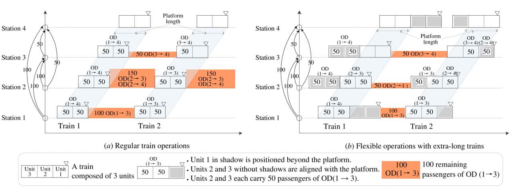
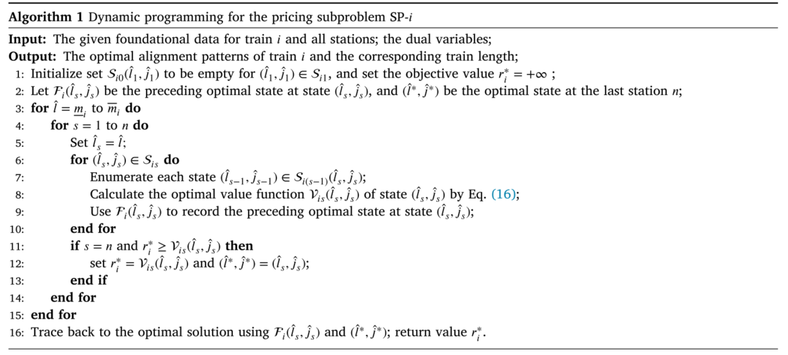
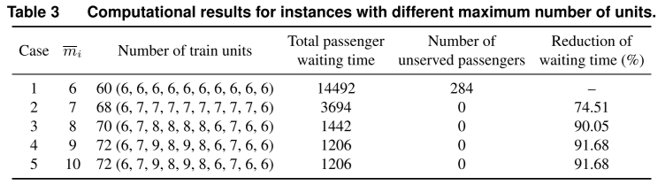
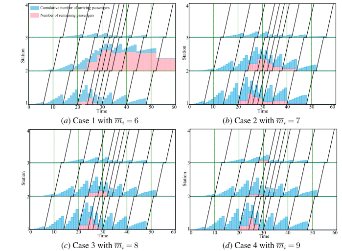
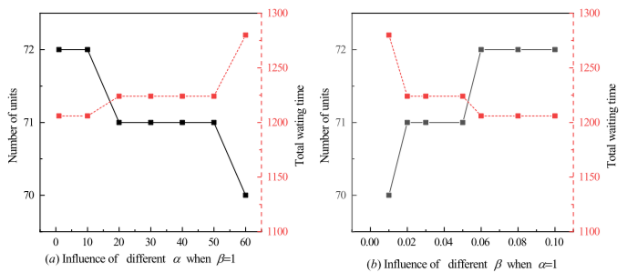
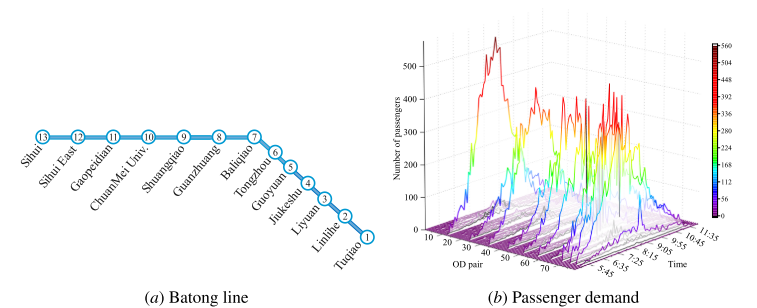

# 论文拾萃 | 如何提升过饱和地铁线路的运输能力？一种灵活的超长列车运营方式

本论文于 2025 年发表于交通领域知名期刊《Transportation Research Part B》上。该研究针对地铁过饱和客流需求，提出了一种灵活的超长列车运行方式，即允许列车长度超出站台范围。在此背景下，首先构建了适用于优化求解器和Benders分解方法的整数线性规划模型，以确定最佳列车编组长度和最优列车停站位置。然后，通过分析模型特点和求解效率，进一步将模型重构为适用列生成算法的优化模型，并提出了分支定价算法。最后，通过若干组不同规模案例验证了模型与算法的有效性，以及超长列车运营方式的优势。

## 关键词
地铁运输能力；过饱和需求；超长列车；列生成；分支定价

## 文章基本信息
>
作者：Xiaopeng Tian, Lixing Yang*
>
标题：How to improve transportation capacity of oversaturated metro lines? A flexible operation approach with extra-Long train compositions
>
文献来源：Transportation Research Part B, 2025, 195, 103188

## 摘要
>
在地铁常规运营中，统一且固定的列车编组成为提升地铁运输能力的一个关键瓶颈。本研究聚焦于基于超长列车（允许列车超出站台两端）的灵活运营方式，尝试通过优化超长列车编组长度，提升高峰时段旅客运输能力。在考虑过饱和时变客流需求条件下，首先构建了一个适用优化求解器和Benders分解方法的整数线性规划模型，以优化列车编组长度和停站位置。然而，模型复杂度分析和初步计算实践表明，直接使用商用求解器和Benders方法难以高效求解大规模问题。为此，本研究对原始模型重构，将其转化为包含大量列变量的优化模型，并采用列生成算法求解其线性松弛模型，设计动态规划方法求解价格子问题。为了获得高质量整数解，本研究进一步设计了分支定价算，并采用分层分支策略，以及提出了多种加速策略。最后，通过若干组不同规模算例，验证了所提模型与算法的有效性，同时证明了超长列车运营方式能够有效减少过饱和客流乘客等待时间。

## 超长列车概念

## 问题描述
> 
针对单条过饱和地铁线路，本文仅考虑其中一个运营方向，如图1所示。由于高峰时段列车通常以最小间隔运行，时刻表优化空间非常有限。鉴于此，本文采用了固定的列车时刻表，以及考虑了所有车站站台长度相同的场景。为便于构模，用 $\overline{l} _s$ 表示车站 $s$ 的站台长度， $t _{i}^s$ 表示设列车 $i$ 在车站 $s$ 的发车时间， $p _{ss't}$ 表示在时间间隔 $t$ 内从车站 $s$ 到 $s'$ 的乘客数量， $a^{ss'} _i$ 表示当列车 $i$ 离开车站 $s$ 时前往车站 $s'$ 的乘客到达客流量，其中 $a^{ss'} _i = \sum _{t _{0} \leq t < t^s _{i}, t \in T} p _{ss't}$ 。
>

 图1 线路示意图 

>
本文要求所有列车仅在起始站由相同容量、尺寸和技术标准的**列车单元**进行编组，允许在给定长度范围 $[\underline{m}_i, \overline{m}_i]$ 内灵活选择编组长度。对于列车 $i \in I$ ，最小长度 $\underline{m}_i$ 设为站台长度，最大长度 $\overline{m}_i$ 由可用列车单元数量决定，并用集合 $U_i = \{1, 2, \dots, \overline{m}_i\}$ 表示它可能使用的列车单元。由于超长列车的长度超过站台长度，导致不同的列车停站位置会形成差异的列车与站台的对齐关系。如图2所示，对于站台长度为6、最大列车长度为10的场景，存在5种可能的对齐关系。为便于表述，本文将这种列车与站台的对齐关系简称为**列车对齐方案**。用集合 $J^s _i$ 为列车 $i$ 在车站 $s$ 的所有候选对齐方案， $j\in J^s _i$ 。根据车站客运组织实践，乘客上下车活动在站台范围内进行。为保证乘客安全顺利的上下车，超长列车仅允许对齐站台的列车单元开启车门，而超出站台的车厢必须保持关闭。如图2所示，对于对齐方案 $j=1$ ，列车单元2至7对齐站台，则要求这些单元的车门开启，以便乘客上下车，其他未对齐站台的列车单元车门必须关闭，禁止乘客进出。
>

图2 列车对齐方案

>

在确保乘客顺利上下车的前提下，列车必须在始发站和目的站同时打开车门。考虑到拥挤的列车车厢和乘客不能跨单元转移的限制，每个乘客只能选择一个唯一的车厢单元。为优化客流，采用基于系统最优的控制策略，通过最小化乘客的总等待时间来确定每个单元的乘客数量。该策略可通过智能乘客信息系统实现，系统为乘客推荐合适的单元，以优化进站人数和确保列车单元的容量得到充分利用。例如，图3所示的最佳客流控制方案，在每个车站通过合理分配乘客到合适的单元，确保单元门在始发站和目的站都能打开，且每个单元的容量得到遵守。

图3 客流控制策略

## 模型建立

### 决策变量

> 针对上述问题，其目的是利用超长列车的灵活运营方式来增加地铁运输能力，从而最大限度地减少过饱和需求的等待时间。该问题涉及到确定以下三个决策：（1）每列列车的长度，（2）每个车站所有列车的对齐模式，（3）客流控制方案。因此，我们引入了三种决策变量来公式化描述问题，如下所述。

|     符号      |                             描述                             |
| :-----------: | :----------------------------------------------------------: |
|  $x_{i}$          |    列车$i$的列车单元数量，即列车$i$的长度，$x_i \in \{\underline{m}_i,\underline{m}_i +1,· · ·，\overline{m}_i\}$|
|   $y_{i}^{sj}$    |  如果列车$i$在车站$s$选择对齐模式$j$，则等于$1$，否则等于$0$                                                                        |
| $b_{iu}^{ss^{'}}$ | 在车站$s$前往目的地为$s^′$站登上列车$i$的$u$个列车单元的乘客数量                                                                       |

> 同时，在公式中使用的其他符号如表1所示。

|     符号      |                             描述                             |
| :-----------: | :----------------------------------------------------------: |
|  $I$          |    列车集合，$i\in{I}$                                       |
|   $S$         |  车站集合，$s\in{S}$                                         |
| $T$           | 时间集合，$t\in{T}$                                          |
|  $D$          |    OD对集合，$(s,s^{'})\in{D}$ 
|   $U_i$       |  列车$i$的所有可能的列车单元组合集合，$u\in{U_i}$              |
| $J^s_i$       | 列车$i$在车站$s$的对齐模式，$j\in{J^s_i}$                     |
|$\overline{l}_{s}$|    车站$s$的站台长度                                      |
|$\overline{m}_{i}$|  列车$i$的最大长度                                        |
|$\underline{m}_{i}$| 列车$i$的最小长度                                        |
|  $t_{i}^s$    |    列车$i$在$s$站的发车时间                                  |
|   $h_{i}^s$   |  列车$i$和$i+1$在$s$站的发车间隔                             |
| $c$           | 单个列车单元的容量                                           |
| $p_{ss^{'}t}$ |    在时间间隔$t$内到达车站$s$并前往车站$s^{′}$的乘客人数      |
|$a^{ss^{'}}_i$ |  当列车$i$离开$s$站时从$s$到$s^{′}$站累计到达乘客数           |
| $l_{i}^{sj}$  | 列车$i$在车站$s$的对齐模式$j$所需的最小列车长度               |
| $k_{iu}^{sj}$ |    如果$u$列车单元的门在$s$站为列车$i$对齐模式为$j$打开，则等于1，否则等于0|

### 目标函数

本文目标函数由两部分构成，一是列车营运成本；二是所有乘客的等待时间

$$
\sum_{i\in I}\alpha_i\cdot x_i+\sum_{i\in I}\sum_{(s,s')\in D}\beta_i^{ss^{\prime}}\cdot(a_i^{ss^{\prime}}-\sum_{i^{\prime}\leq i}\sum_{u\in U_{i^{\prime}}}b_{i^{\prime}u}^{ss^{\prime}})\cdot h_i^s
$$

### 约束条件

- **列车长度和对齐模式约束**
>
$x_{i}\geq\sum_{j\in J_{i}^{s}}y_{i}^{sj}\cdot l_{i}^{sj},\quad\forall s\in S,i\in I\mathrm{(1)}$
>
$\sum_{j\in J_{i}^{s}}y_{i}^{sj}=1,\quad\forall s\in S,i\in I.\mathrm{(2)}$

- **客流控制约束**
>
$\sum_{s^{\prime}\in S,s^{\prime}>s}b_{iu}^{ss^{\prime}}\leq\sum_{j\in J_{i}^{s}}y_{i}^{sj}\cdot k_{iu}^{sj}\cdot c,\forall u\in U_{i},s\in S,i\in I\mathrm{(3)} $
>
$\sum_{s^{\prime}\in S,s^{\prime}<s}b_{iu}^{s^{\prime}s}\leq\sum_{j\in J_{i}^{s}}y_{i}^{sj}\cdot k_{iu}^{sj}\cdot c,\forall u\in U_{i},s\in S,i\in I\left(4\right) $
>
$\sum_{s^{\prime}\leq s,s^{\prime\prime}>s}b_{iu}^{s^{\prime}s^{\prime\prime}}\leq c,\forall u\in U_{i},s\in S,i\in I\mathrm{(5)}$
>
$\sum_{i^{\prime}\leq i}\sum_{u\in U_{i^{\prime}}}b_{i^{\prime}u}^{ss^{\prime}}\leq a_{i}^{ss^{\prime}},\forall(s,s^{\prime})\in D,i\in I.\mathrm{(6)}$

- **决策变量域约束**
>
$x_{i}\in\{\underline{m}_{i},\underline{m}_{i}+1,\cdots,\overline{m}_{i}\},\forall i\in I(7)$
>
$y_{i}^{sj}\in\{0,1\},\forall j\in J_{i}^{s},s\in S,i\in I(8)$
>
$b_{iu}^{ss^{\prime}}\in\mathbb{Z}_{+},\forall u\in U_{i},(s,s^{\prime})\in D,i\in I,(9)$
>
为了清楚起见，本文将上述优化模型记为M0。
## 模型重构
考虑到上述模型的复杂性，大规模模型M0难以有效求解。为了实现对实例的高质量求解，本文采用列生成处理此问题。在基于列的建模框架下，该问题的目标是为每个列车选择唯一的列，以实现最小的目标函数。因此，本文引入基于列的决策变量：
>$z_{ip}$：如果列$p$被列车$i$使用则等于1，否则等于0。
>
利用新引入的变量和参数，模型M0可以重新表述为以下模型，记为M1。
>
$min \sum_{i\in I}\sum_{p\in P_{i}}\alpha_{i}\cdot n_{ip}\cdot z_{ip}+\sum_{i\in I}\sum_{(s,s^{\prime})\in D}\beta_{i}^{ss^{\prime}}\cdot(a_{i}^{ss^{\prime}}-\sum_{i^{\prime}\leq i}\sum_{u\in U_{i^{\prime}}}b_{i^{\prime}u}^{ss^{\prime}})\cdot h_{i}^{ss^{\prime}} (11)$
>
$\sum_{p\in P_{i}}z_{ip}=1,\quad\forall i\in I \mathrm{(12)} $
>
$\sum_{s^{\prime}\in S,s^{\prime}>s}b_{iu}^{ss^{\prime}}\leq\sum_{p\in P_{i}}z_{ip}\cdot\bar{k}_{ip}^{su}\cdot c,\forall u\in U_{i},s\in S,i\in I  \mathrm{(13)} $
>
$\sum_{s^{\prime}\in S,s^{\prime}<s}b_{iu}^{s^{\prime}s}\leq\sum_{p\in P_{i}}z_{ip}\cdot\bar{k}_{ip}^{su}\cdot c,\forall u\in U_{i},s\in S,i\in I  (14)$ 
>
$z_{ip}\in\{0,1\},\quad\forall p\in P_{i},i\in I \mathrm{(15)}$
>
约束$(5)，(6)，(9)$。
>
在模型M1中，约束$(12)$确保每列火车仅选择一个唯一列，约束$(13)$$和$(14)$保证乘客上下车活动，其含义与约束$(3)$和$(4)$相同。基于上述列表示，很明显，每列内所有车站的列车长度和对齐模式固有地满足约束$(1)$和$(2)$。因此，基于列的模型M1被公式化而不需要这两个约束。与紧凑模型M0相比，模型M1包含指数数量的变量$z_{ip}$。因此，模型M1不能由求解器直接处理，因为枚举真实的实例的所有列是不切实际的。
相反，限制主问题(RMP)可以通过考虑列$\bar{P}_i\subseteq P_i$的子集和线性松弛整数变量$(0 ≤ z_{ip} ≤ 1且b^{ss'}_{iu} ≥ 0)$来获得。利用RMP的对偶解，可以构造定价子问题来寻找具有负减少成本的列以更新RMP，并且提出了一个定制的动态规划，以快速找到每个定价子问题的精确最优解。

## 算法设计

> 算法思想

如上所述，列生成通常以主问题的松弛解终止。因此，分支定界过程被用来寻找整数解。在每个分支定界节点处，本文使用列生成算法获得最优松弛解，其目标值是该节点处的下界。如果这个下界不小于当前的上界，则相关的节点被修剪；否则，必须进行分支。当列生成得到的松弛解为整数且对应的目标值小于当前上界时，可以用此解更新上界。本文基于深度优先策略，对分枝定界树进行了探讨。为了生成可行解，本文首先使用当前分支节点处获得的列更新模型RMP，然后将变量$z_{ip}$和$b^{ss^{'}}_{iu}$分别设置为二进制和整数变量，最后使用商业优化软件直接求解更新后的模型。由于启发式过程是耗时的大规模的实例，只实现了一些分支节点，以加快计算。此外，本文提出了一些加速策略，以提高该算法的性能。
> - 加速策略

> - 解空间缩减

## 算例实验

在本文中，使用几组不同规模的算例例来评估所提出的方法的有效性和效率。

> - 小规模算例
>
考虑了一条有4个车站和10列车的单向城轨线路。在这条线路上，所有列车从车站1到车站4运行。通过一系列基本设置，通过改变最大列车长度$(\overline{m}_i)$来获得五个实例，计算结果如表3所示。从表3可以看出，随着最大单元数的增加，乘客等待时间显著减少。

为了进一步证明列车长度对乘客等待时间的影响，图5示出了情况1-4的乘客累积等待过程。显然，情况1的剩余乘客数最多，情况4的剩余乘客数最少。超长列车对减少旅客候车时间有显著影响。此外，还进行了四种不同策略下的对比分析。

图5 案例1-4的乘客等待过程图示

最后，进行了灵敏度分析，分析了在不同$\alpha$和$\beta$组合下目标函数各部分的变化，结果如图6所示。给定$\beta = 1$，随着参数$\alpha$的增加，使用的列车单元数量减少，乘客等待时间增加。变化趋势见图6(a)。相反，给定$\alpha = 1$，随着$\beta$的增加，使用列车单元数增加，乘客等待时间减少，如图6(bb)所示。值得注意的是，在图6(b)中，发现当$\beta$增加到仅0.06时，最优解不会改变。换句话说，大幅增加乘客候车时间的权重值，并不会导致增加更多列车单元以减少乘客候车时间。

图6 参数α和β的灵敏度分析

> - 大规模算例
>
本文以北京地铁八通线13个车站为大规模算例，线路及客流变化如图7所示，对所提方法的性能进行了测试。如上所述，目标函数中的参数$β^{ss^{′}}_i$也起到乘客登机优先级的作用。为了分析各种优先级设置的影响并与实际基准进行比较，分别考虑了三种不同设置，即$XLT-SP$、$XLT-DP$和$RT-FIFO$，优化结果如图8、9和10所示。

图7 大规模算例线路及客流分布

图8 XLT-SP的乘客累计等待过程

图9 XLT-DP的乘客累计等待过程

图10 RT-FIFO的乘客累计等待过程

对于每种过载情况，我们分别使用XLT-SP、XLT-DP和RT-FIFO设置解决实验。计算结果列于表5中。显然，采用相同优先级控制策略的超长列车运行方法（XLT-SP）在减少乘客等待时间方面始终优于其他方法。本文所提出方法为不同程度的列车拥挤情况提供全面评估。在给定特定列车超载水平的情况下，它还可以生成量身定制的、有效的超长列车运行方案，以及相应的客流控制方案。通过管理客流和提高运输能力，所提出的解决方案为缓解高峰需求带来的运输压力提供了宝贵的见解。

>
此外，为了验证本文方法的效率，本文所提出的方法与其他多种方法的效率进行了比较，结果如表6所示。在本文中，考虑了四种方法。对于G-M0方法，它能够将小规模实例IN-10-4求解到最优解，并获得中等规模实例IN-80-13的近优解。然而，这种方法无法获得高质量的解决方案，甚至无法获得大规模实验的可行解决方案。对于SBD-M0方法，它只能解决一些小规模的实例，并且难以有效地解决其他实例，特别是在LB没有看到显著改善的情况下。第三种方法，CG-H-M1，可以实现严格的下限，但不会显着提高上限，从而导致不太理想的差距。最后，本文所提出的方法可以解决小规模的情况下最优，并对于中型和大型的情况可以获得高质量的解决方案。相比之下，本文的方法优于的其他方法。

对于每组实例，我们还研究了当$\overline{m}_i$从7变化到12时，与常规列车组成$(\overline{m}_i = 6)$相比，乘客等待时间的减少，如图24所示。研究结果表明，超长列车更适合于处理空间异质性较高的过饱和客流需求。

图13 与6个列车单元的常规运行方案相比，乘客等待时间减少

